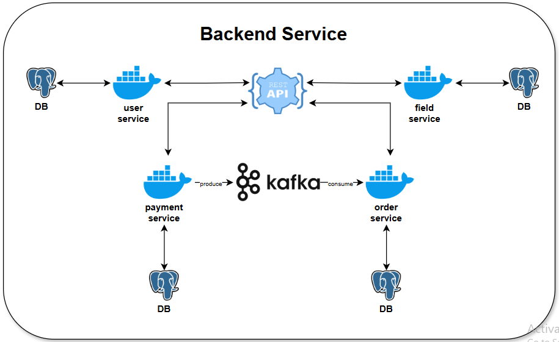

# Backend Golang Microservices

# Goal

This system is designed to make it easy for mini soccer enthusiasts to book mini soccer fields online. With this system, all processes—from booking to payment—can be handled seamlessly.

# Scope

The scope of this system includes managing fields and their schedules, handling bookings, and processing payments.

# Tech Stack

| **Category**         | **Tech**                    |
| -------------------- | --------------------------- |
| Database Engine      | PostgreSQL                  |
| Programming Language | Golang                      |
| Framework            | Gin & Gorm                  |
| API Protocol         | Rest API                    |
| Message Broker       | Apache Kafka                |
| Containerization     | Docker                      |
| CI/CD                | Jenkins                     |
| Cloud Computing      | Google Cloud Provider (GCP) |
| Payment Gateway      | Midtrans                    |
| Storage              | Google Cloud Storage (GCS)  |
| Store Data Key Value | Consul KV                   |
| Frontend             | Next.Js                     |
|                      |                             |

# Flow

1. Admin → Login
2. Admin → Manage Field
3. Admin → Manage Field Schedule
4. Customer → Register
5. Customer → Login
6. Customer → Create Order
7. Customer → Pay Order
8. Done

# API Documentation

[Mini Soccer Field Booking System | BWA Projects](https://www.postman.com/ilhamiakbar27/workspace/bwa-projects/collection/8051022-1f58a7f2-e9ef-425f-89a9-767fc78ef0de?action=share&creator=8051022&active-environment=8051022-9f2bf04c-1578-4036-8901-9dc0a44650a0)

# Entity Relationship Diagram (ERD)

# Backend Service Flow Diagram

